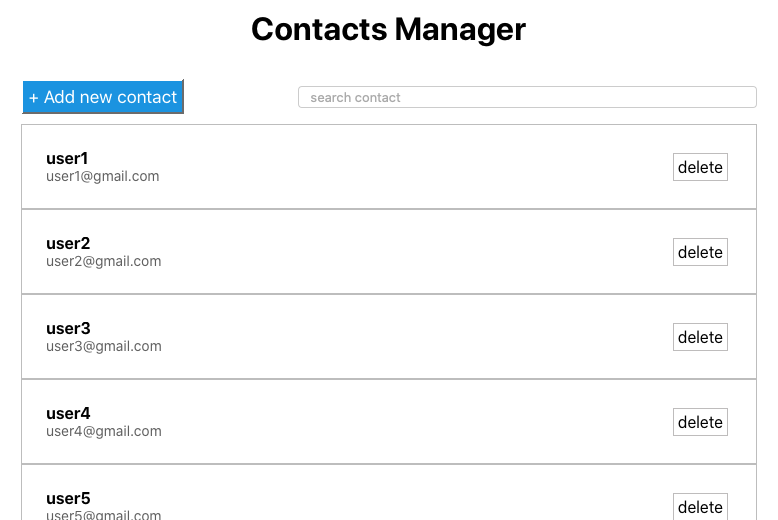
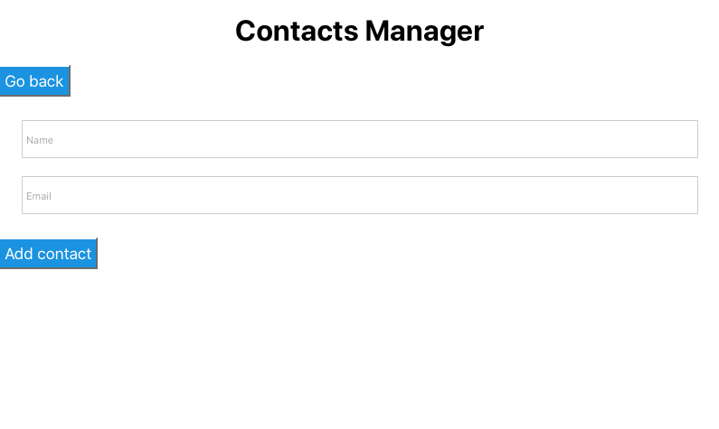
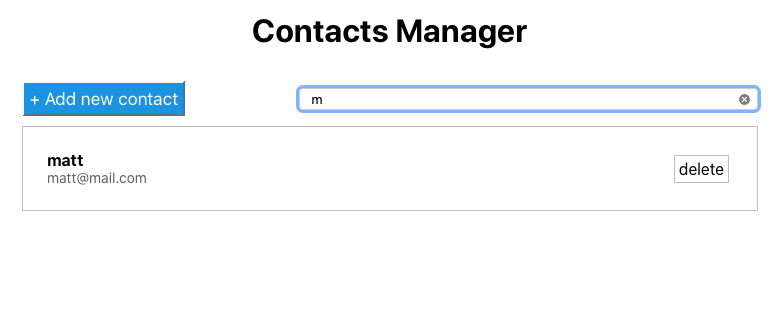
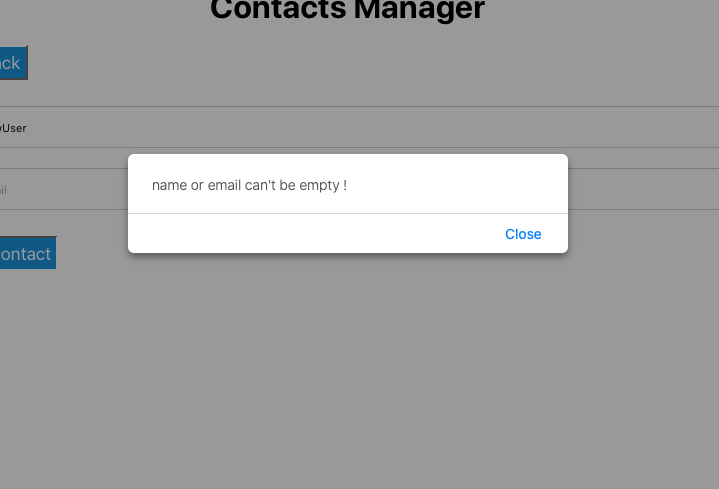
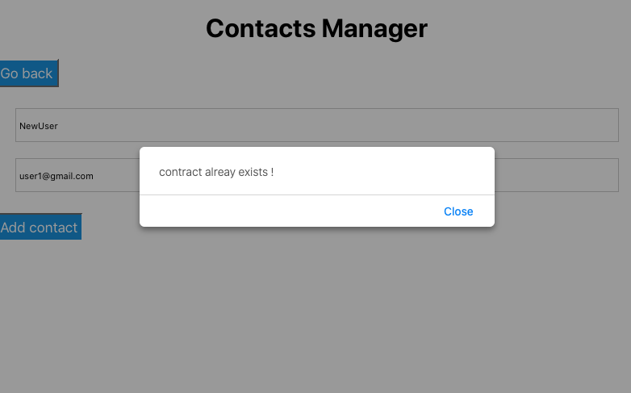

# Contact Manager Application using [React js](https://reactjs.org) , React-Router and React-Hooks.

## Features this app have

### **list all the contacts**

### **create new contact**

### **filter contacts**

### **validation like:**

name, email and email already exists

### setting up the project

`git clone https://github.com/himansh-gjr/contact-manager.git`

`cd contacts-manager`

In the project directory, you can run:

#### `npm start`

Runs the app in the development mode.\
Open [http://localhost:3000](http://localhost:3000) to view it in the browser.

The page will reload if you make edits.\
